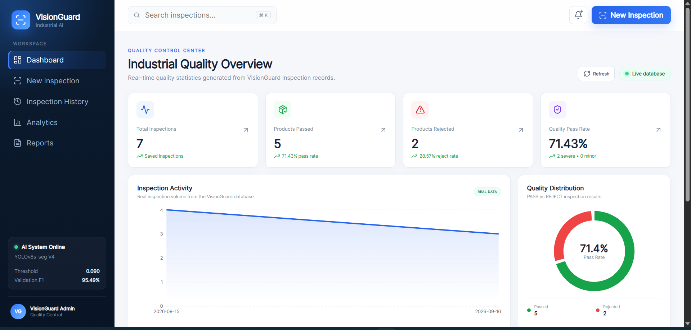
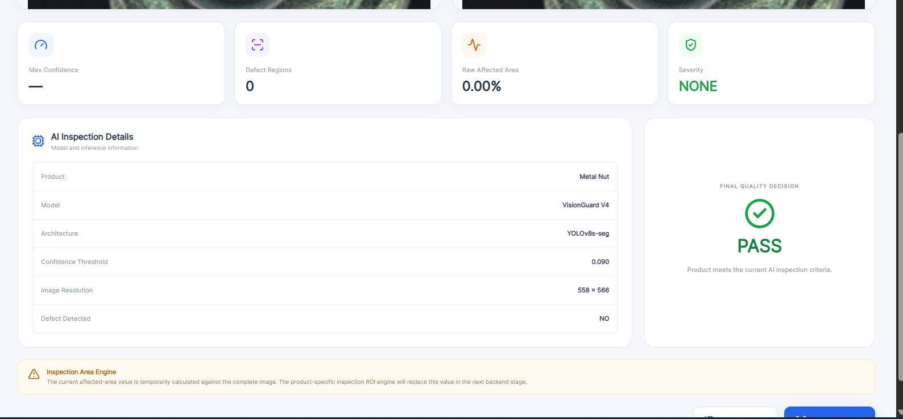
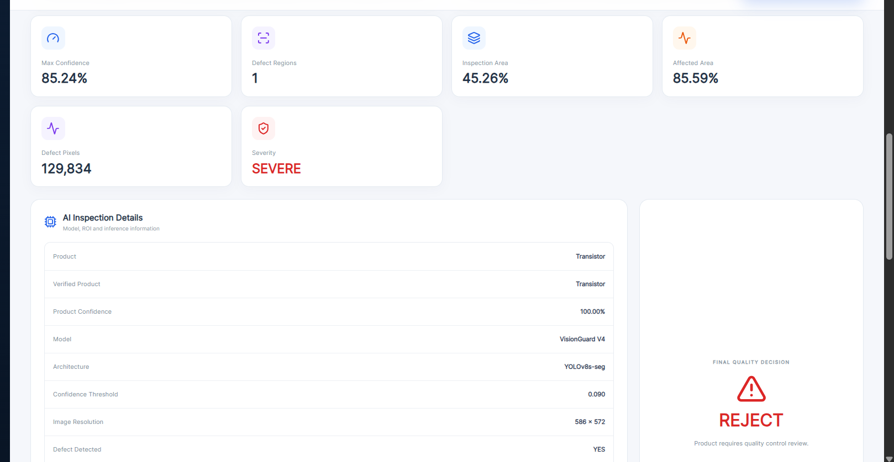
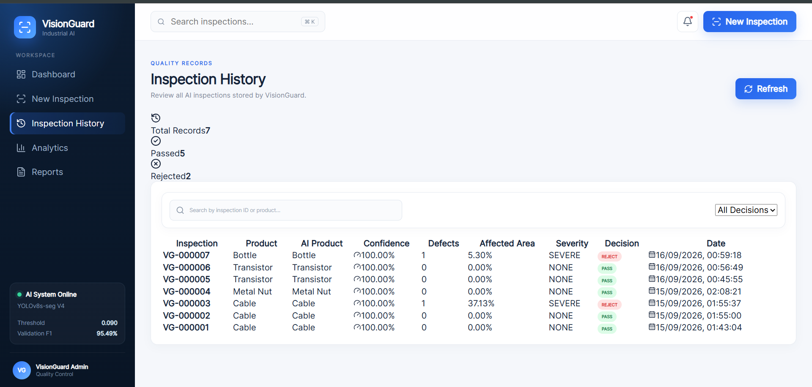
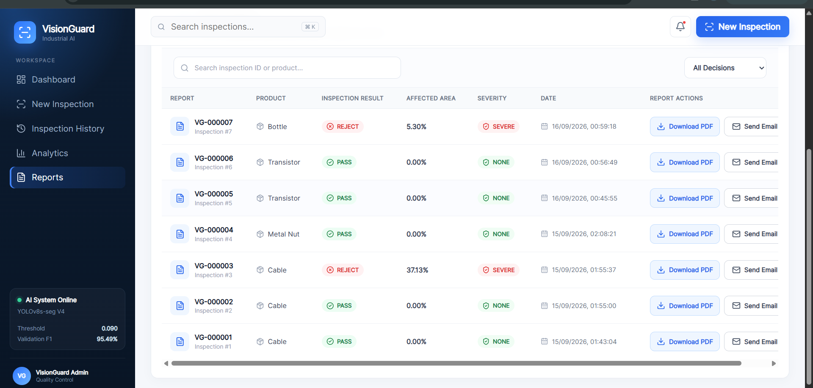
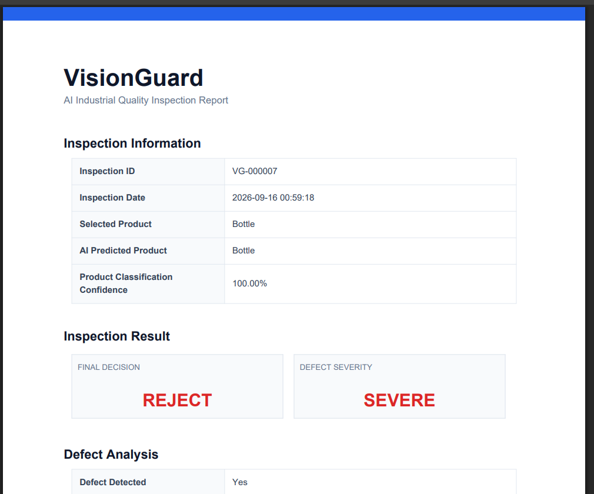
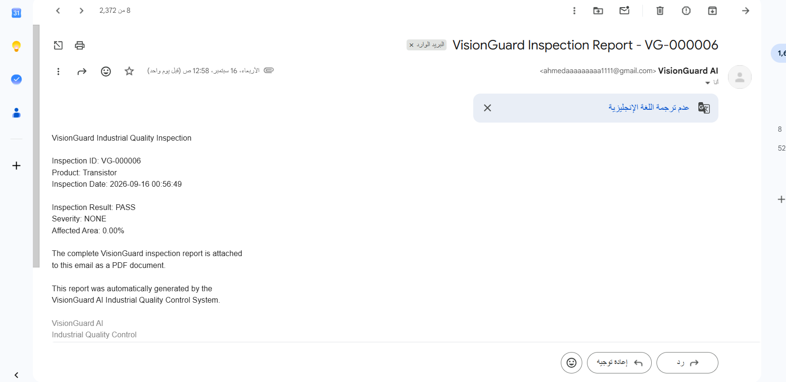
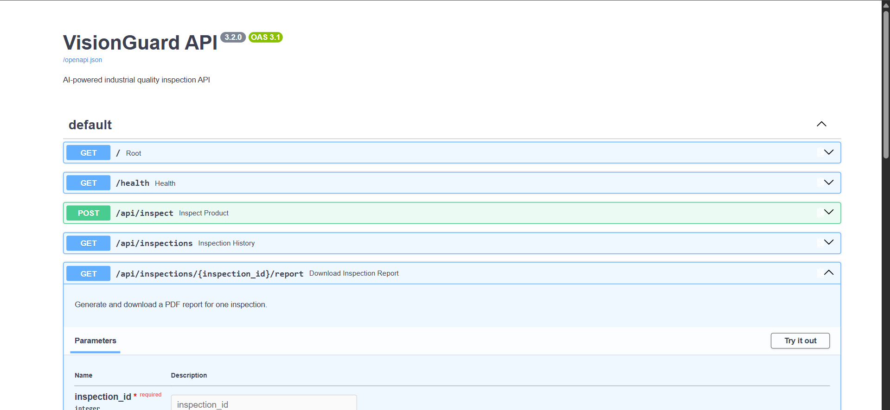

# 🏭 VisionGuard AI

### AI-Powered Industrial Quality Inspection & Defect Detection System

VisionGuard is an end-to-end Computer Vision system designed to automate industrial product quality inspection.

The system combines **product classification, defect segmentation, product-specific inspection regions, defect severity analysis, automated quality decisions, inspection history, analytics, PDF reporting, and email report delivery** in a web-based inspection platform.

Instead of only predicting whether a product is defective, VisionGuard attempts to answer:

- What product is being inspected?
- Does the uploaded product match the selected category?
- Is a defect present?
- Where is the defect located?
- How much of the inspection area is affected?
- How severe is the defect?
- Should the product PASS or be REJECTED?
- Can the inspection result be stored, reviewed, exported, and shared?

---

## 🚀 System Pipeline

```text
Product Image
      │
      ▼
┌──────────────────────────────┐
│ Product Classification Model │
│       15 Categories          │
└──────────────┬───────────────┘
               │
               ▼
      Category Validation
          │           │
       Match       Mismatch
          │           │
          │           └──► Stop Inspection
          ▼
┌──────────────────────────────┐
│ VisionGuard V4 Segmentation  │
│        YOLOv8s-seg           │
└──────────────┬───────────────┘
               │
               ▼
        Defect Masks
               │
               ▼
┌──────────────────────────────┐
│ Product-Specific ROI Engine  │
└──────────────┬───────────────┘
               │
               ▼
       Defect ∩ Inspection ROI
               │
               ▼
       Affected Area (%)
               │
               ▼
       Severity Estimation
               │
               ▼
         PASS / REJECT
               │
               ▼
        Save Inspection
               │
               ▼
     Dashboard / History
               │
               ▼
       PDF / Email Report
```

---

## 🖥️ VisionGuard Interface

### 📊 Industrial Quality Dashboard

The dashboard provides an overview of saved inspection results, pass/reject statistics, inspection activity, and quality distribution.



---

### 🔍 New Inspection

Users can upload a product image, select its expected category, and start the AI inspection pipeline.



---

### 🎯 AI Defect Inspection Result

After product validation, VisionGuard performs defect segmentation and displays the inspection result, affected area, severity, and final quality-control decision.



---

### 🗂️ Inspection History

Completed inspections are stored in the database and can be reviewed later through the Inspection History interface.



---

### 📑 Reports Center

The Reports interface provides access to generated inspection reports and stored quality-control results.



---

### 📄 Automated PDF Inspection Report

VisionGuard can dynamically generate a PDF report for an individual inspection.

The report is generated from the inspection data stored in the database and includes the relevant inspection information and AI results.



---

### 📧 Email Report Delivery

Generated inspection reports can also be delivered by email directly from the VisionGuard backend.



---

### ⚡ FastAPI / Swagger API

The backend provides REST API endpoints for inspection, history, dashboard analytics, PDF generation, and email report delivery.



---

## ✨ Core Features

### 🔎 Product Verification

Before defect inspection starts, VisionGuard verifies that the uploaded image matches the product category selected by the user.

If the selected category does not match the AI prediction, the defect segmentation stage is blocked.

This prevents an incorrect inspection configuration from being passed directly to the defect detection model.

---

### 🎯 Defect Segmentation

VisionGuard V4 uses **YOLOv8s-seg** to localize defects at pixel level.

The segmentation model uses a single segmentation class:

```text
0 = defect
```

Product identity is handled independently by the product classification model.

The use of instance segmentation allows separate defect regions to be represented independently by their masks.

---

### 📐 Inspection ROI Engine

Defect coverage is not calculated blindly against the complete image.

VisionGuard generates an inspection Region of Interest (ROI) depending on the product category.

The system currently uses multiple ROI strategies:

- Full-surface inspection
- Foreground extraction
- Circular inspection zones
- Product-specific ROI logic

The final affected area is calculated as:

```text
Affected Area (%) =
Defect Pixels Inside ROI
──────────────────────── × 100
Inspection ROI Pixels
```

---

### ⚠️ Severity Analysis

VisionGuard uses a configurable severity threshold:

```text
Severity Threshold = 5%
```

Current quality rules:

```text
No detected defect
→ Severity: NONE
→ Decision: PASS

Detected defect + affected area < 5%
→ Severity: MINOR
→ Decision: REJECT

Detected defect + affected area >= 5%
→ Severity: SEVERE
→ Decision: REJECT
```

The 5% value is a configurable project threshold and is not presented as a universal industrial standard.

---

### 💾 Inspection Database

Inspection results are stored using **SQLite**.

Each saved inspection can contain information such as:

```text
Inspection ID
Inspection Code
Product Category
AI Product Prediction
Product Confidence
Defect Detection Result
Defect Region Count
Affected Area
Severity
PASS / REJECT Decision
Creation Time
```

The stored data powers the Inspection History, Dashboard, Reports, and reporting workflow.

---

### 📄 PDF Reporting

VisionGuard generates inspection reports dynamically in the backend.

The reporting workflow is:

```text
Inspection ID
      ↓
Retrieve Inspection from SQLite
      ↓
Generate PDF Report
      ↓
Return application/pdf
      ↓
Download Report
```

PDF reports are generated programmatically using Python and **ReportLab**.

FastAPI returns the generated report using a streaming file response.

---

### 📧 Email Reporting

VisionGuard can send an inspection report directly to a recipient email address.

The workflow is:

```text
Recipient Email + Inspection ID
              ↓
            FastAPI
              ↓
 Retrieve Inspection from SQLite
              ↓
      Generate PDF Report
              ↓
       Attach PDF to Email
              ↓
          Gmail SMTP
              ↓
        Recipient Email
```

Email credentials are kept outside the source code using environment variables.

---

## 🧠 AI Models

### 1. Product Classification Model

**Architecture:** YOLO11s-cls

**Task:** 15-class product classification

The classifier verifies the product identity before the defect segmentation stage.

Held-out MVTec test results:

| Metric | Result |
|---|---:|
| Test Images | 817 |
| Accuracy | 100% |
| Macro Precision | 100% |
| Macro Recall | 100% |
| Macro F1 | 100% |

> The classification results are measured on a held-out split from the MVTec domain. The product categories are visually distinct, and these results should not be interpreted as guaranteed performance on arbitrary real-world imagery.

---

### 2. VisionGuard V4 Defect Segmentation

**Architecture:** YOLOv8s-seg  
**Task:** Instance-level pixel defect segmentation  
**Classes:** 1 (`defect`)

VisionGuard V4 was fine-tuned with additional lighting and image augmentation.

Locked operating confidence threshold:

```text
0.090
```

Validation image-level quality-control performance at the selected threshold:

| Metric | Result |
|---|---:|
| Accuracy | 95.50% |
| Precision | 95.74% |
| Recall | 95.24% |
| Specificity | 95.77% |
| F1 Score | 95.49% |

Segmentation validation metrics:

| Metric | Box | Mask |
|---|---:|---:|
| Precision | 0.838 | 0.846 |
| Recall | 0.711 | 0.717 |
| mAP@50 | 0.765 | 0.788 |
| mAP@50-95 | 0.488 | 0.436 |

---

## 🤖 Why YOLOv8-seg?

VisionGuard requires more than a binary defect mask.

For each detected defect, the system benefits from:

```text
Defect Instance
      ↓
Bounding Box
      ↓
Confidence Score
      ↓
Pixel-Level Mask
      ↓
Affected Area Calculation
```

YOLOv8-seg provides detection and instance segmentation in the same model.

### Why not standard U-Net?

A traditional U-Net performs semantic segmentation.

It can classify pixels as:

```text
Background
or
Defect
```

If several disconnected defects exist, they may appear as separate regions in the semantic mask, but they are not represented directly as independent detected instances.

Additional post-processing such as connected-component analysis or contour extraction would be required to explicitly separate and process each defect region.

### Why not SAM?

SAM is a powerful general-purpose and promptable segmentation model.

However, it is not inherently a task-specific industrial defect detector.

A SAM-based pipeline may require additional prompting, detection logic, or another model to identify which segmented regions should actually be considered defects.

For VisionGuard, YOLOv8-seg provides a more direct automated workflow:

```text
Image
  ↓
Defect Detection
  ↓
Individual Defect Masks
  ↓
Confidence Scores
  ↓
ROI Analysis
  ↓
Affected Area
  ↓
QC Decision
```

The choice of YOLOv8-seg is therefore based on the requirements of this project rather than claiming that it is universally superior to U-Net or SAM.

---

## 📊 ROI Coverage Validation

The ROI-based defect coverage pipeline was evaluated against MVTec ground-truth defect masks.

For detected test defects:

| Metric | Result |
|---|---:|
| MAE | 0.864 percentage points |
| Median Absolute Error | 0.282 percentage points |
| RMSE | 1.895 percentage points |
| Correlation | 0.9952 |
| Error ≤ 1 percentage point | 82.32% |
| Error ≤ 5 percentage points | 94.48% |

The correlation value represents agreement between predicted and ground-truth coverage measurements and should **not** be interpreted as classification accuracy.

---

## 🏷️ Supported Product Categories

VisionGuard currently supports all 15 MVTec AD product categories:

| # | Product |
|---:|---|
| 1 | Bottle |
| 2 | Cable |
| 3 | Capsule |
| 4 | Carpet |
| 5 | Grid |
| 6 | Hazelnut |
| 7 | Leather |
| 8 | Metal Nut |
| 9 | Pill |
| 10 | Screw |
| 11 | Tile |
| 12 | Toothbrush |
| 13 | Transistor |
| 14 | Wood |
| 15 | Zipper |

---

## 📐 ROI Strategies

### Full Surface

The complete image is used as the inspection surface for:

```text
Carpet
Grid
Leather
Tile
Wood
Zipper
```

### Foreground Extraction

Background-aware foreground extraction is used for:

```text
Bottle
Capsule
Hazelnut
Metal Nut
Pill
Toothbrush
```

### Specialized Inspection

Special ROI logic is currently used for:

```text
Cable
Screw
Transistor
```

---

## 🗂️ Dataset

The project uses the **MVTec Anomaly Detection (MVTec AD)** dataset.

It contains industrial product images with normal and anomalous samples and pixel-level ground-truth masks for defective test samples.

VisionGuard currently uses all 15 product categories.

### Important Methodology Note

The standard MVTec AD benchmark is designed primarily for **unsupervised anomaly detection**, where models are normally trained using defect-free training samples.

VisionGuard repurposes MVTec defect images and masks into a **supervised segmentation workflow** with train, validation, and test splits.

Therefore, VisionGuard's segmentation results should **not be directly compared with standard MVTec AD benchmark results** without accounting for this methodological difference.

---

## 🧪 Segmentation Dataset Preparation

The supervised segmentation dataset contains:

```text
2,516 images
```

Balanced composition:

```text
1,258 defective
1,258 good
```

Split:

| Split | Images |
|---|---:|
| Train | 1,760 |
| Validation | 378 |
| Test | 378 |

Ground-truth binary masks were converted into YOLO segmentation polygons.

All defect types are represented through the single segmentation class:

```text
defect
```

---

## 🖥️ Web Application

VisionGuard includes a web-based industrial inspection interface.

### Frontend

Built with:

- React
- Vite
- JavaScript
- Lucide React

The interface provides:

- Product image upload
- Product category selection
- AI product verification
- Product mismatch protection
- Defect segmentation visualization
- Inspection ROI visualization
- Confidence information
- Defect region count
- Inspection area
- Defect pixel count
- Affected area
- Severity classification
- Final PASS / REJECT decision
- Inspection history
- Dashboard statistics
- Inspection reports
- PDF download
- Email report delivery

### Backend

Built with:

- Python
- FastAPI
- Ultralytics
- OpenCV
- NumPy
- SQLite
- ReportLab

The backend performs:

```text
Image Validation
      ↓
Product Classification
      ↓
Category Verification
      ↓
YOLO Defect Segmentation
      ↓
Inspection ROI Generation
      ↓
Defect / ROI Intersection
      ↓
Affected Area Calculation
      ↓
Severity Estimation
      ↓
Quality Decision
      ↓
Database Storage
      ↓
Reporting
```

---

## ⚡ API Endpoints

VisionGuard exposes REST API endpoints through FastAPI.

```text
POST /api/inspect
     Run a new product inspection

GET  /api/inspections
     Retrieve saved inspection history

GET  /api/inspections/{inspection_id}
     Retrieve one inspection

GET  /api/dashboard
     Retrieve dashboard statistics

GET  /api/inspections/{inspection_id}/report
     Generate and download a PDF report

POST /api/inspections/{inspection_id}/email
     Generate and email an inspection report
```

Interactive API documentation is available through Swagger when the backend is running.

---

## 📁 Project Structure

```text
VisionGuard/
│
├── assets/
│   └── images/
│       ├── api_swagger.png
│       ├── dashboard.png
│       ├── defect_result.png
│       ├── email_report.png
│       ├── inspection_history.png
│       ├── new_inspection.png
│       ├── pdf_report.png
│       └── reports.png
│
├── backend/
│   │
│   ├── data/
│   │
│   ├── model/
│   │   ├── VisionGuard_V4_best.pt
│   │   └── VisionGuard_ProductClassifier_best.pt
│   │
│   ├── database.py
│   ├── detector.py
│   ├── email_service.py
│   ├── inspection_logic.py
│   ├── main.py
│   ├── product_classifier.py
│   ├── report_generator.py
│   └── requirements.txt
│
├── frontend/
│   │
│   ├── public/
│   │
│   ├── src/
│   │   ├── assets/
│   │   ├── pages/
│   │   ├── App.css
│   │   ├── App.jsx
│   │   ├── index.css
│   │   └── main.jsx
│   │
│   ├── package.json
│   └── vite.config.js
│
├── notebooks/
│   ├── VisionGuard segmentation / evaluation notebook
│   └── VisionGuard product classification notebook
│
├── .gitignore
└── README.md
```

---

## ⚙️ Running VisionGuard Locally

### 1. Clone the Repository

```bash
git clone https://github.com/AhmedRahim01/VisionGuard-AI-Industrial-Defect-Inspection.git
cd VisionGuard-AI-Industrial-Defect-Inspection
```

---

### 2. Backend Setup

Move to the backend:

```bash
cd backend
```

Create a virtual environment:

```bash
python -m venv venv
```

Activate it on Windows:

```bash
venv\Scripts\activate
```

Install dependencies:

```bash
pip install -r requirements.txt
```

Start the FastAPI server:

```bash
uvicorn main:app --reload
```

Backend:

```text
http://127.0.0.1:8000
```

FastAPI documentation:

```text
http://127.0.0.1:8000/docs
```

---

### 3. Frontend Setup

Open another terminal:

```bash
cd frontend
```

Install dependencies:

```bash
npm install
```

Start Vite:

```bash
npm run dev
```

The frontend is normally available at:

```text
http://localhost:5173
```

---

## ⚠️ Current Limitations

VisionGuard is currently a research/prototype inspection system rather than a production-certified industrial quality-control platform.

Current limitations include:

- Performance is primarily evaluated within the MVTec image domain.
- Significant changes in camera position, lighting, background, or product appearance may cause domain shift.
- ROI extraction quality varies between product categories.
- Some product categories may require further ROI and segmentation optimization.
- The current 5% severity threshold is project-defined and would need to be calibrated to actual manufacturing requirements before production deployment.
- The current system is intended as a research and graduation-project prototype rather than a certified industrial deployment.

---

## 🛣️ Development Roadmap

- [x] Product classification
- [x] Product-category verification
- [x] Defect segmentation
- [x] Product-specific ROI engine
- [x] Defect coverage calculation
- [x] Severity estimation
- [x] Automated PASS / REJECT decision
- [x] Web inspection interface
- [x] SQLite inspection database
- [x] Inspection history
- [x] Analytics dashboard
- [x] PDF inspection reports
- [x] Email report delivery
- [x] Production statistics
- [ ] Additional model and ROI optimization
- [ ] Real industrial-domain validation
- [ ] Production deployment optimization

---

## 🎯 Project Objective

VisionGuard demonstrates how multiple Computer Vision and Software Engineering components can be combined into a complete industrial inspection workflow rather than using a single isolated AI model.

The project integrates:

```text
Product Classification
        +
Instance Segmentation
        +
Image Processing
        +
ROI Analysis
        +
Decision Logic
        +
Database
        +
Backend API
        +
Web Application
        +
PDF Reporting
        +
Email Delivery
```

into one end-to-end quality inspection system.

---

## 📄 License & Dataset Notice

The MVTec AD dataset is subject to its own licensing terms.

The dataset is commonly distributed under **CC BY-NC-SA 4.0** terms. Users of this project should review and comply with the original dataset license before using the dataset or derived work, particularly for commercial applications.

---

## 👨‍💻 Development Status

**VisionGuard is actively under development.**

Current stage:

```text
AI Pipeline          ✅
Product Validation   ✅
Defect Segmentation  ✅
ROI Analysis          ✅
Web Interface         ✅
SQLite Database       ✅
Inspection History    ✅
Dashboard             ✅
PDF Reporting         ✅
Email Reporting       ✅
API Documentation     ✅
```

---

### VisionGuard AI

**Industrial AI Defect Inspection & Quality Control System**